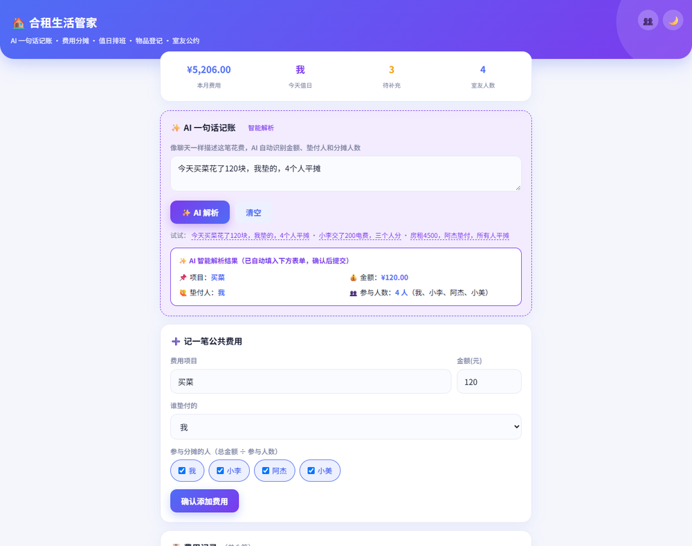

<div align="center">

# 🏠 合租生活管家 · Roommate Hub

**用 AI 一句话记账，把"填表"变成"说一句话"**

一个面向合租场景的生活管理网页应用 · 纯原生前端 · 零依赖 · 数据本地持久化


### 🔗 [👉 点击在线体验 · fangbouuu.github.io/roommate-hub](https://fangbouuu.github.io/roommate-hub/)

</div>



<div align="center"><sub>▲ 首页概览 + ✨ AI 一句话记账（自动解析并填入表单）</sub></div>

---

## 📑 目录

- [📖 项目背景](#-项目背景)
- [✨ 核心亮点：AI 一句话记账](#-核心亮点ai-一句话记账)
- [🧩 功能模块](#-功能模块)
- [🎨 设计与体验](#-设计与体验)
- [🛠 技术实现](#-技术实现)
- [📂 项目结构](#-项目结构)
- [🚀 本地运行](#-本地运行)
- [💡 设计取舍与后续规划](#-设计取舍与后续规划)

---

## 📖 项目背景

合租生活中最常见的矛盾来源：

| 痛点 | 具体表现 |
|---|---|
| 💸 **钱算不清** | 房租水电谁多出一块、谁还没转钱，只能靠群里翻聊天记录 |
| 🧹 **值日没人管** | 公共区域清洁排班混乱，"今天该谁"没人记得 |
| 🧻 **物品没记录** | 抽纸、洗洁精用完没人补，谁买的也说不清 |
| 📜 **约定不成文** | 口头约定容易忘、容易吵 |

**本项目目标**：用一个**轻量到极致**的网页工具（打开即用、无需注册、数据本地保存）把这些痛点一次性解决。

---

## ✨ 核心亮点：AI 一句话记账

> 这是本项目的差异化功能，也是一次 "**用 AI 降低操作摩擦**" 的具体落地。

### 用户只需要说一句话

```
今天买菜花了120块，我垫的，4个人平摊
小李交了200电费，三个人分
```

### 系统自动解析并填入表单

```
✨ AI 智能解析结果（已自动填入下方表单，确认后提交）
📌 项目：买菜        💰 金额：¥120.00
🙋 垫付人：我        👥 参与人数：4 人（我、小李、阿杰、小美）
```

### 实现方式（纯前端正则，不调用大模型 API）

采用 **正则表达式 + 规则引擎** 模拟 AI 解析 —— **零成本、零延迟、离线可用、数据不出本地**：

| 解析要素 | 策略 |
|---|---|
| **金额** | 优先 `数字 + 块/元/人民币/¥` → 其次 `花了/交了/付了 + 数字` → 兜底取首个**非"人数"**的数字（避免把"4个人"误判为金额） |
| **项目** | 命中费用关键词库（水电费/买菜/房租/网费…）→ 否则提取"动词前的名词" |
| **垫付人** | 匹配 `人名/我 + 垫的/付了/交了/垫付/出的`，并与室友名单做校验匹配 |
| **参与人数** | 识别 `4个人 / 三个人 / 5人均摊`，**支持中文数字**，并识别"所有人 / 大家" |
| **参与人范围** | 优先级：**具体人名 > 人数 > 默认全体**；并**自动排除垫付人干扰**（避免"我垫的"被误判为参与人） |

### 💡 产品思考

> 记账类工具最大的流失点不是"不想记"，而是"**填表太麻烦**"。
> AI 一句话记账把**四步操作**（选项目 → 输金额 → 选垫付人 → 勾分摊人）压缩为**一步说话**。
>
> 这才是 AI 在工具类产品里最有价值的用法：**不是炫技，而是减少用户的操作成本。**

---

## 🧩 功能模块

### 1. 💰 费用分摊
- **AI 一句话记账** / 手动记账，两种入口
- 自动计算：`每人应分摊 = 总金额 ÷ 参与人数`
- **实时结算汇总**：每人「应收 / 应付 / 已结清」净额一目了然
- **最少笔数转账建议**（贪心算法）：把多人互相转账压缩成最少几笔
- **费用构成可视化**：按项目聚合的占比条形图
- **一键复制账单**：生成排版好的结算文本，直接粘贴到室友群

### 2. 📅 值日排班
- 设置开始日期 + 轮换周期（每天 / 每周）
- 自动生成**未来 7 天排班表**，按室友顺序轮换
- **今日视觉强化**：渐变 Hero 卡 + 🔥 脉冲徽章 + 圆形头像 + 大字姓名 —— **3 秒抓住"今天该谁"**
- **清洁打卡**：标记今日已完成，并显示**本周清洁进度条**


<div align="center"><sub>▲ 值日排班：今日值日的大头像 + 徽章 + 进度条视觉强化</sub></div>

### 3. 📦 公共物品
- 登记物品名称 / 当前数量 / 警戒线
- 数量 ≤ 警戒线时**自动标红提醒**「⚠ 需补充」
- 快捷 `+1 / −1` 操作

### 4. 📜 室友公约
- 条款增删，把共同约定写在明处、减少摩擦

### 附加能力
- 👥 **室友管理弹窗**：自由增删室友，费用下拉 / 参与勾选 / 值日排班**全部实时同步**
- 🗂 **数据管理**：复制账单 / 备份为 JSON / 从备份恢复 / 一键生成示例数据 / 清空重置
- 🌗 **深色模式**：一键切换、记忆偏好、默认跟随系统

---

## 🎨 设计与体验

- **科技感蓝紫渐变主色**：`#4f6df5 → #7c3aed`
- **移动端优先**：底部 Tab 栏（💰 费用 / 📅 排班 / 📦 物品 / 📜 公约）、响应式布局、刘海屏安全区适配、可添加到手机主屏
- **细腻动效**：按钮 hover 上浮 / 点击回落、卡片阴影渐变、视图淡入、进度条平滑过渡
- **体验兜底**：Toast 轻提示、空状态引导 + 一键示例数据、**页面加载遮罩**（国内访问等待期不白屏）

---

## 🛠 技术实现

| 项 | 说明 |
|---|---|
| 技术栈 | **纯原生 HTML + CSS + JavaScript**（无 Vue / React，无任何第三方库） |
| 数据持久化 | `localStorage`（含结构兜底，兼容旧数据） |
| AI 解析 | 正则表达式 + 规则引擎（前端模拟，**不调用大模型 API**） |
| 状态管理 | 单一数据源 `S` + 统一 `renderAll()` 渲染 |
| 部署 | GitHub Pages（单文件应用） |

### 关键算法

- **结算净额**：遍历每笔费用，垫付人 `+总额`、每个参与人 `−均摊额`，得到每人净收支
- **最少转账笔数**：将「应付方」与「应收方」排序后贪心配对冲抵，最小化转账次数
- **AI 正则解析**：按「金额 → 项目 → 人数 → 垫付人 → 参与人」逐层提取，每层设优先级与兜底

---

## 📂 项目结构

```
roommate-hub/
├─ index.html         # 单文件应用（HTML + CSS + JS 全内嵌，打开即用）
├─ screenshot-1.png   # 截图：首页 + AI 记账
└─ screenshot-2.png   # 截图：值日排班
```

---

## 🚀 本地运行

直接双击 `index.html` 即可（**无需构建、无需安装依赖**）。

也可用任意静态服务器托管：

```bash
python -m http.server 8000
# 浏览器打开 http://localhost:8000
```

---

## 💡 设计取舍与后续规划

**当前取舍**

- AI 解析采用**前端正则**而非真实大模型 API：零成本、零延迟、离线可用、**隐私友好（数据不出本地）**，非常适合轻量工具场景。
- 数据只存浏览器本地，**不上传任何服务器**。

**后续可迭代**

1. 接入真实 LLM，提升自然语言泛化能力（覆盖更口语化、更复杂的表达）
2. 账单历史与月度报表（趋势、环比分析）
3. 多人实时协作（需引入后端与账号体系）
4. 导出 PDF / Excel 账单

---

<div align="center"><sub>本项目为 <b>AI Coding（Vibe Coding）能力演示作品</b> · 所有数据仅保存在用户浏览器本地，隐私友好</sub></div>
